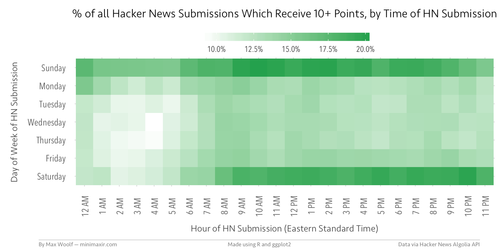

I spent a few days examining the mechanics of Hacker News (HN) and I discovered some open secrets. "Open" because they're not private. "Secret" because they're not well known. One of them can triple the chances of a story reaching the front page.

They are listed below with a sprinkling of my own analysis. Sources are included so you can explore further.

## Sandbox, Live List, and the Top30

There are three parts of Hacker News which I'm calling the Sandbox, the Live List and the Top30.

The Top30 are the top 30 stories which appear on the [front page](https://news.ycombinator.com/new) of [Hacker News](https://news.ycombinator.com). Stories with more points/upvotes are ranked higher. Stories which are older are ranked lower. An algorithm balances these two factors.

The Live List is the rest of the top stories after the Top30. These appear on [page two](https://news.ycombinator.com/news?p=2) and [three](https://news.ycombinator.com/news?p=3) and so on.

The Sandbox is the ['new'](https://news.ycombinator.com/newest) section and lists all stories ranked by time. Newer stories appear higher.

When a new story is posted, it is listed only in the sandbox. Once (or if) it has 5 points, then it also appears in the Live List.

## Making the front page

A story needs to accumulate 5 points to appear in the Live List. Where it initially appears depends on how quickly it accumulated points. If points are acquired quickly enough, it appears high enough to be in the Top30. Otherwise, it appears at a lower position.

Once a story appears on the Live List, it will have more exposure and acquire more points.

Stories which begin life on the Live List on page two or three sometimes accumulate more points quickly enough to rise up to the Top30.

## Upvote conversion rate

The upvote conversion rate is the proportion of readers who upvote a story. It's a proxy for how strongly a story appeals to readers. More interesting stories will have a higher rate of upvotes.

Whether a story (acquires 5 points and) escapes the sandbox depends on the rate and the number of page views.

`Chance of escaping sandbox = upvote conversion rate ✕ views`

Consider an example.

A newly submitted story will get around 30 page views from being listed in the Sandbox (The actual number varies so let's just talk about averages). All stories start with one point. If it gets 4 additional upvotes, it will escape the Sandbox.

In other words, the story must persuade 13.3% or more of readers to upvote. That's a pretty high conversion rate.

In practice, most stories will rate much lower. Hence, some luck is needed: Either a transient boost in the conversion rate, or more page views.

## Timing

Timing affects how many times a sandboxed story is viewed.

`Views = number of users online / rate of new submissions`

But timing is not predictable in a reliable way.

Posting a story during a busy period means more viewers and more chances for upvotes. But there are also more newer stories that push it down the Sandbox ranking too.

The best time to post is when the ratio of viewers to new stories is highest. But no one knows with certainty when that happens.

> the analysis is probabilistic. You are not guaranteed to get onto the front page just by submitting on at a high-probability time.
>
> ...
>
> There are game-theoric implications; the more people submitting at a time (weekday mornings), the less likely people will see your post on /new before it is pushed off the first page, and it is highly unlikely to get upvotes once it has fallen off the top 30 slots. (hence the repost/second chance rules)
>
> -- https://news.ycombinator.com/item?id=11515207

## Most stories 'fail'

Most stories 'fail' and have only one or two points.

> The median is either 1 (no upvotes) or 2 (just 1 upvote)
>
> -- https://news.ycombinator.com/item?id=9864254

[If your HN submission doesn't get any upvotes, don't worry about it](https://news.ycombinator.com/item?id=9864254). Don't take it personally.

For example, [tptacek](https://news.ycombinator.com/user?id=tptacek) is one of the most well-known users on Hacker News. He has a [pretty good track record of getting blog posts on the front page](https://news.ycombinator.com/item?id=23458896) yet his 'success' rate is around 50%.

## Re-posting

Hacker News allows re-posts. This is not widely known.

>  If a story has not had significant attention in the last year or so, a small number of reposts is ok. Otherwise we bury reposts as duplicates. 
>
> -- https://news.ycombinator.com/newsfaq.html

Albeit, a 'small number' is not defined.

Personally, I'd stay at 3. I'd also wait at least a day between re-posts (and try re-posting at different time slots).

**Re-posting can triple-or-more the chances of a story reaching the front page.**

Here is a story that was posted six times:

https://hn.algolia.com/?dateRange=all&page=0&prefix=false&query=https%3A%2F%2Fwww.lihaoyi.com%2Fpost%2FFromFirstPrinciplesWhyScala.html&sort=byDate&type=story

## Don't delete and re-post

The flip-side of re-posting is that delete-and-repost is not allowed.

> Please don't delete and repost the same story. Deletion is for things that shouldn't have been submitted in the first place. 
>
> -- https://news.ycombinator.com/newsfaq.html

> Don't do this.
> 
> pg has said that this is a ban worthy offense. And I still see people doing it. 
>
> -- https://news.ycombinator.com/item?id=6861740

## Text posts are penalised

Submissions which are text and lack a URL (sometimes called a 'self post') have a ranking penalty applied. The factor has been estimated to be a 0.4 or 0.7 multiplier. (Source: [Why you should submit your stuff as a blog posting](https://news.ycombinator.com/item?id=1076633))

If you must post text, consider posting a link and then submit the text as a comment.

> Posts without URLs get penalized, so you'd be better off posting this with a link, then adding your text as a first comment in the new thread.
>
> -- https://news.ycombinator.com/item?id=21874086

## Show HN

The Show HN section of Hacker News also has a [sandbox](https://news.ycombinator.com/shownew) and it's own live ['Show'](https://news.ycombinator.com/show) listing.

> Every Show HN appears on shownew. Once it clears a small points threshold, it will appear on the show page in the top bar. 
> 
> -- https://news.ycombinator.com/showhn.html

(I don't know what the points threshold for Show HN is.)

A story which is posted to ['Show HN'](https://news.ycombinator.com/showhn.html) appears in both sandboxes and has more opportunities to be upvoted.

## Karma

[Do posts by authors with more karma rank higher?](https://news.ycombinator.com/item?id=23458656) The answer is: No.

## Escape velocity

Taking into account all of the above:

`Chance of escaping sandbox = re-posts ✕ upvote conversion rate ✕ number of users online / rate of new submissions`

## Second chance pool

A small proportion of interesting stories which didn't attract enough upvotes are curated by the moderators. 

It is taken out of the sandbox and it's timestamp is artifically manipulated so it appears in the second half of the Top30. From there, it decays normally.

> Moderators and a small number of reviewer users comb the depths of /newest looking for stories that got overlooked but which the community might find interesting. Those go into a second-chance pool from which stories are randomly selected and lobbed onto the bottom part of the front page. This guarantees them a few minutes of attention. If they don't interest the community they soon fall off, but if they do, they get upvoted and stay on the front page.
>
> -- https://news.ycombinator.com/item?id=11662380

The implication? The Top30 is a combination of organically-upvoted stories and moderator-boosted stories.

## Vote manipulation

Hacker News has software to detect vote manipulation (ie. asking friends to upvote).

[Voting ring detection has been one of HN's priorities for over 12 years](https://news.ycombinator.com/item?id=22761897) and it's pretty good.

> HN's anti-voting-ring software is now so strict that the main thing we have to do is turn it off when a submission is good enough
>
> -- https://news.ycombinator.com/item?id=15511238

If you get past the voting ring detector, you won't get past the readers.

Hacker News readers are very protective of the site. Stories which reach the Top30 via dubious means attract intense scrutiny. Sometimes even organically-upvoted stories are suspected.

> readers reacted negatively, even violently, to seeing junk on HN's front page. By "junk" I mean stories that were placed there randomly and that weren't of high-enough quality to otherwise be credible candidates for the front page. Basically, it was an "ow my eyes", "get that shit away from me" effect.
>
> ...
>
> **HN users have an intense emotional relationship with the front page**. This shows up in the inevitable "How is this on HN?" comments when a story somehow violates the commenter's personal contract or mental model of HN. ... lessons I drew from that experience: (1) people's relationship with HN is surprisingly personal
>
> -- https://news.ycombinator.com/item?id=21868928 (emphasis added)

## dang

Hacker News is moderated mainly by [dang](https://news.ycombinator.com/user?id=dang) aka Dan Gackle (pronounced 'Gackley'). He's not of asian descent. But [he](https://news.ycombinator.com/item?id=20643264) [is](https://news.ycombinator.com/item?id=25054045) [the](https://news.ycombinator.com/item?id=25049415) [best](https://news.ycombinator.com/item?id=25049119) [moderator](https://news.ycombinator.com/item?id=25056408) [in](https://news.ycombinator.com/item?id=25048958) [the](https://news.ycombinator.com/item?id=25051566) [world](https://news.ycombinator.com/item?id=25052249).

## Random

The story 'Learn Git Branching' has been posted almost 20 times across [two](http://pcottle.github.io/learnGitBranching/) [urls](https://learngitbranching.js.org/). The distribution of points is [pretty](https://news.ycombinator.com/from?site=pcottle.github.io) [random](https://news.ycombinator.com/from?site=learngitbranching.js.org).

## Further reading

* [A List of Hacker News's Undocumented Features and Behaviors](https://github.com/minimaxir/hacker-news-undocumented)
* [The Lonely Work of Moderating Hacker News](https://www.newyorker.com/news/letter-from-silicon-valley/the-lonely-work-of-moderating-hacker-news) ([comments](https://news.ycombinator.com/item?id=20643052) and more [comments](https://news.ycombinator.com/item?id=25048415))
* [Awesome Hacker News](https://github.com/cheeaun/awesome-hacker-news) - A collection of awesome Hacker News apps, libraries, resources and shiny things
