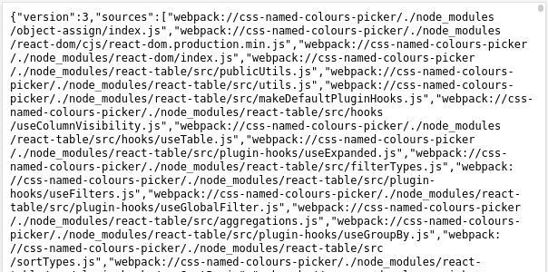
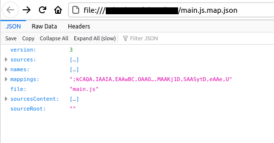

[JSON](https://www.json.org/json-en.html) is ubiquitous and I often run into it whilst developing or debugging.

When it's in raw form like this ...

it's hard for a human to interpret.

For small snippets, I could copy-and-paste it into a text file and hand-prettify it. For long snippets, that's obviously not scalable.

I stumbled upon a very useful tool for interpreting and analysing (extremely) long JSON snippets. The surprising thing is that it's been around for a long time and I just never noticed. However, once I knew about it, I kept using it, and it's now my go-to tool for analysing long JSON snippets.

The tool?

**Mozilla Firefox.**

Yes, the web browser. (It also helps that Firefox is my main browser.)

Here is a link to a random JSON file from the internet:

https://raw.githubusercontent.com/bengtan/bengtan.github.io/main/content/css-named-colours-picker/dist/main.js.map

If you click on the link with Firefox you get something human-unfriendly:

However, if you open a file with a `.json` extension on your local computer , you get ...

... which is a nice and useful and human-friendly json browser with collapsible sections, pretty printing and **filtering**.

(I think Firefox shows the json browser when the mimetype is set to json, and opening a local file with a `.json` extension is an easy way to set the mimetype.)

I stumbled upon this by chance. But since then, everytime I have a long JSON snippet to debug, I save it to a text file, give it a `.json` extension and open it with Firefox.

* * *

Okay, so installing Firefox just to browse JSON is probably overkill, but this is great for me since I already use it.

I'm glad Firefox is my main browser.

