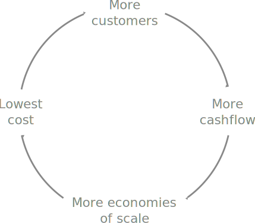
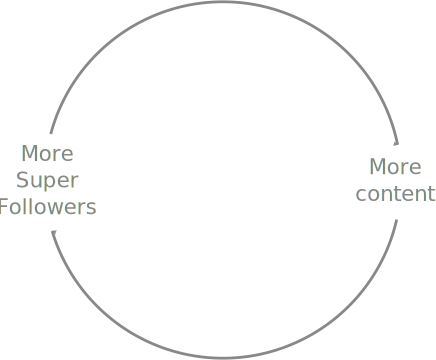

Twitter's newly announced Super Follows feature could be transformative for the company. I don't just mean 'It is a good idea'. I mean that, in 5+ years time, Twitter could be a completely different company.

Why? Because Super Follows aligns the incentives for all three parties into a virtuous cycle.

<!--more-->

## Virtuous cycle

A [virtuous cycle](https://en.wikipedia.org/wiki/Virtuous_circle_and_vicious_circle) is a chain of events that:

> reinforce themselves through a feedback loop. ... Each iteration of the cycle reinforces the previous one.

A virtuous cycle tends to repeat. If it iterates a bit larger or faster each time, this can lead to exponential growth.

Here is Amazon's virtuous cycle:

Look how big it's grown.

## Adversarial

Twitter's main revenue source is advertising. But advertising is adversarial (Both words even come from the same Latin word _advertere_). It requires parties playing off against each other:

* Users don't want to look at ads. But advertisers want them to.
* Twitter doesn't really want to show ads. But the need for revenue forces them to.
* Advertisers want attention. But users don't like playing ball.

Growing advertising-based revenue involves a lot of friction and balancing competing interests. Diminishing returns easily sets in.

To increase revenue, show more ads. But more ads degrades the user experience and users turn off. Revenue growth slows. To compensate, show more ads. More users turn off. Repeat.

There is a more insidious effect.

Twitter is incentivised to optimise user engagement. More user engagement means more ad views. More ad views means more revenue.

How does Twitter optimise user engagement? One effective way is through anger or outrage. When people are angry, they are motivated to engage.

This is warped and perverse. Twitter is not just connecting users to people and ideas that matter, but also exposing them to addiction and abuse.

In the short term, this feels great. Users are engaged. Ad views are up. Revenue is up.

In the long term, it's a problem. Not just for users' mental health, but for Twitter as well. Optimising for outrage presents a headwind on further growth.

## Substack

Substack gets the virtuous cycle right:

> The only way we succeed is if writers using Substack succeed ... and writers only succeed if their readers are happy. Everyone’s incentives are aligned
>
> -- https://on.substack.com/p/the-future-of-substack

> The beauty here is our growth incentives line up too. As more people choose to pay writers directly, more writers join, and yet more readers follow. Together, we are building new, positive communities of publishers and subscribers, and the whole thing keeps getting better for everyone. 
>
> -- https://on.substack.com/p/a-new-game

## Super opportunity

Super Follows (in the way it has been described by Twitter so far) is a virtuous cycle. Super Followers pay Creators for content. Creators produce more content. More Super Followers join. Creators are paid more and produce more. Repeat. 

Creators, Super Followers, and Twitter grow together in a virtuous cycle:

Super Follows is an opportunity to supplant an adversarial revenue model with one where every one is aligned in the same direction. If Creators succeed, then Super Followers are happy. If Super Followers are happy, then Twitter succeeds.

A virtuous-cycle-based revenue model has more upside and lifts the ceiling on growth potential. There is much less friction and revenue 'grows by default'. No counter-balancing of competing interests. No diminishing returns. Just let the cycle keep spinning.

Once Super Follows revenue becomes significant, it will lessen reliance on advertising revenue. Then Twitter can focus on growing the relationships between Creators and Super Followers.

The key performance metric will no longer be engagement. Engagement becomes just another intermediate step (and relegated to the background). The key performance metric will become number of Super Followers &mdash; A holistic metric which has a direct and clearer relationship to revenue.

If Super Follows revenue grows enough to dominate advertising revenue, then the 'feel' of Twitter will shift too. It no longer needs to generate anger and outrage. Instead, it will be rewarded for nurturing deeper connections between Creators and their fans. Years later, the experience of using Twitter will be completely different. And better for users' mental health too.

If we imagine how the the last sentence of the Substack quote might apply to Twitter, it could read: 'Together, we are building new, positive communities of creators and followers, and the whole thing keeps getting better for everyone.'

This is the future that Super Follows enables.

Maybe.

## The wildcard is Apple

I qualify the above with some conditions.

The first is execution risk. Twitter does not always has a track record of delivering its promises in a timely manner. But we all know that.

The second risk is the fee breakdown. I presume that Twitter will siphon off some percentage of the payments from the Super Followers to the Creators. Getting the commission rate correct is critical. Too much, and negative publicity about Twitter's 'greed' will hold back adoption. Too little, and Twitter can't wean itself off advertising revenue.

Timing is important too. Will Twitter be patient and allow enough time for Super Follows revenue to become significant? Or will it quickly get cold feet and prefer the comfort zone of advertising revenue?

The wildcard risk is Apple. Apple's going to want it's 30% cut. 30% of what, though? If a Super Follower pays $10 and Twitter charges 10%, then does Apple want $3 or $0.30? Or can Twitter avoid the Apple tax somehow? This is the most critical risk. It could completely break Super Follows.
