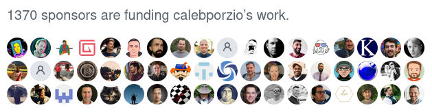
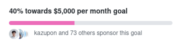

## Previously

A few weeks ago, I wrote Email Cleaner and started using it to clean tracking links and pixels from my email newsletters. It works well. I can hover over links (or long press for touch devices) and see the URL. I can click on them **without being tracked**. I can protect myself from phishing.

When I [announced Email Cleaner](/blog/email-cleaner-clean-tracking-links-and-pixels/) to the world, I got [some feedback](https://news.ycombinator.com/item?id=26293424) from the great people at Hacker News. (I also posted to a couple of other places but didn't get any comments.)

Two things stood out in the feedback.

> ... you get my Email address and newsletters I like. ... Now it is a question of trusting a random guy on the internet to be better and not sell my data to the highest bidder. Maybe open source could address this to some extend.
>
> -- https://news.ycombinator.com/item?id=26313017

There were privacy concerns. Some didn't like the idea of sending their email newsletters to a third party. Fair enough, I understand.

And:

> this [is] something that should be directly integrated into email clients, not something I would get a third party app for 
>
> -- https://news.ycombinator.com/item?id=26300617

It was suggested that a service such as Email Cleaner should be integrated into the email client. I agree and disagree. It naturally belongs in the email system though not necessarily at the client side.

(I'm probably biased. Working with email clients is like fighting a multi-headed hydra. I don't want to go there. 😊)

I came up with a new approach to address these concerns. I could rewrite Email Cleaner to be self-hosted, open source, and plug into mail servers.

It would be like 'Email Cleaner v2'. 

But I still want to monetise it somehow. (I know this can be controversial. Read more about it below.)

So I'd like to talk about this and see what you, the readers and potential users, think. It will help me guage whether this is viable.

Even if you disagree with me, the discussion below about monetising open source is still interesting.

## Proposal

What is Email Cleaner v2?

Firstly, I'm going to change the name to Untracker. Emphasising the anti-tracking aspect seems to connect with users better. It's still the same functionality as before but with different packaging and branding.

(From here on, Email Cleaner refers to the original SaaS service. Untracker refers to this new 'v2' proposal.)

Untracker will be an **open source** utility that can be plugged into **self-hosted** email servers.

Untracker sits in front of an email mailbox (like a Mail Delivery Agent). When it receives an email, it processes the email by cleaning tracking links and pixels. (For an explanation of what cleaning involves, [please see the previous article](/blog/email-cleaner-clean-tracking-links-and-pixels/).)

Then, depending on configuration, it can:

* Send the cleaned email back to the sender, or
* Send the cleaned email to a preconfigured email address, or
* Deliver the cleaned email to the mailbox.

The first mode is how Email Cleaner currently works. Send an email newsletter to it and it will reply with the cleaned version. This mode uses a dedicated email address to reach the service. (For example, Email Cleaner uses `email-cleaner@bengtan.com`.)

The second mode is a minor variation of the first. It sends to a preconfigured email address instead. This mode uses an intermediate email address (ie. `subscriptions@domain`) which can act as a man-in-the-middle email forwarder.

The third mode delivers the cleaned email to the user's inbox. Each email newsletter appears in the inbox twice: The original version and the cleaned version. This mode does not require an additional email address. It is the most exciting because it integrates closely with the email system.

Whatever the mode of operation, the emails stay on the server. They are not sent to a third party (ie. me).

Untracker requires that you self-host your own email server. If you're not self-hosting, maybe you can find a friend who is. Your friend can configure Untracker in mode 1 or 2 and you can send your newsletters to it.

If you can't find anyone to run Untracker for you, you can use the original Email Cleaner service (but you'd be sending your email newsletters to a third party ie. me).

## Monetisation

Self-hosted Untracker will be open source.

But I've already mentioned above that I want to monetise it somehow. This is important to me. I'm trying to [build a salary](https://onlysponsors.dev/) for myself so I can work full-time on open source or other projects.

## The problem with Github Sponsors

[Github Sponsors](https://github.com/sponsors) looks like the way to go.

Unfortunately, there is a problem with Github Sponsors. It's the same problem whenever payments are optional. The problem is human nature.

In theory, sponsorship (or synonymously, 'donationware') sounds great. In practice, the 'conversion' rate is too low. I don't have any hard metrics but I vaguely remember reading articles years ago. They cite the rate of donations to be some crazy low number like 0.001% or something. It's just too low to be practical.

FWIW, I've also tried donationware in the past, and my experience corroborates with this. People just don't donate.

I don't blame people. If you're not pushed to pay money for something, you usually don't think about it. It's just the way it is. **Donationware doesn't work unless it's pushed in-your-face**. Massively in-your-face.

I see similar characteristics with Github Sponsors. When I look at developers who offer sponsorship, I often see unsustainably low sponsorship rates.

However, there is an outlier: The [high profile case](https://calebporzio.com/i-just-hit-dollar-100000yr-on-github-sponsors-heres-how-i-did-it) of Caleb Porzio, a developer who has [1370+ sponsors and $20k+/month](https://github.com/sponsors/calebporzio) (estimated) in sponsorships (and is still growing).

Compare this against a core developer of one of the most widely used javascript frameworks. This second developer has the 'normal' low rate of sponsors. He has [73 sponsors and $2k/month](https://github.com/sponsors/posva) in sponsorships.

That's a massive difference between Caleb and the second developer.

What accounts for the difference? Caleb has less github followers (2.6k vs 2.7k), more twitter followers (23.3k vs 10.8k) and a higher minimum sponsorship tier ($14 vs $1). These aren't the reason. For example, they don't explain the disparity in number of sponsors (1370 vs 73).

### Payment Decision Point

I think the reason is hiding in plain sight: Caleb charges for value added content. He says so himself:

> Sponsored Screencasts ... This is where the VAST majority of my sponsorships came from.

> A few weeks later I added a new “private” group of screencasts for GitHub sponsors only. ... THIS is the secret sauce 🌶️.
>
> -- https://calebporzio.com/i-just-hit-dollar-100000yr-on-github-sponsors-heres-how-i-did-it

His sponsorships aren't really sponsorships in the usual sense of the word. Instead, they are payments for premium content.

This comes back to what I said above. Donationware doesn't work unless it's in-your-face. There is nothing more in-your-face than 'you have to pay for this'.

People are paying Caleb because they want to sponsor him but also because they want content. I suspect the latter is much greater than the former.

Here's another statistic. During the few days between conceptualising and then writing this article, the number of his sponsors has gone from 1331 to 1370. That's 39 new sponsors in a few days. Wow.

I wouldn't expect such a high rate of new sponsors if it was purely to sponsor him per se. There's something else going on.

* * *

Anyway. This makes me think.

If I want to make 'sponsored open source' work, there has to be a payment for _something_. And the _something_ has to be (somewhat) valuable.

There has to be a 'Payment Decision Point' where potential sponsors are forced to confront the question 'Oh, is this where I make a payment now?'. Otherwise people won't think about it. They'll move on.

To achieve sustainable sponsorship with Untracker, I have to put something behind a paywall.

## Untracker's sponsorship model

Here's the proposed sponsorship model with an in-built Payment Decision Point. I hope this will allow Untracker to be both open source and monetised.

* A public repository will contain the compiled binary and entry level documentation.
* The binary will be free for non-commercial use.
* Source code and advanced documentation will be in a private repository accessible by sponsors only.
* The source code will be open source. I've currently settled on the [Affero General Public License Version 3](https://www.gnu.org/licenses/agpl-3.0.en.html) (AGPL) license.
* Sponsors are encouraged to build from source. Commercial usage is allowed under the open source license.
* Sponsorship starts at $12 per month. Higher tiers are available for super fans and companies. I'll regularly review the sponsorship tiers for suitability.

This is a freemium model. Most people can use Untracker for free but sponsorship unlocks further benefits.

Sponsors get all the usual benefits of open source. They can inspect and modify the source code. They get access to support.

They can also redistribute the source code. I hope they don't though I can't enforce it. Redistribution would completely break this model.

I hope sponsors see value in continuing sponsorship. It pays for support, new features (see below) and ongoing maintenance. Maintenance will be required because this is a cat-and-mouse game with the mailing list providers. Once they learn about Untracker, I expect them to change their tracking links to try to avoid it.

For me, I get:

* To continue to work on Untracker, and
* One component of my quest to build a salary for myself.

I hope this model strikes a good balance for everyone and nurtures both Untracker and the Untracker community.

## Other stuff

Some other random information. Skip over any uninteresting bits.

### Rewrite

Untracker will be a completely new rewrite. The original Email Cleaner code has some hardcoded constants specific to my internal email setup and is unsuitable for publishing.

Untracker will be written in golang and compiles to a single CLI binary.

### Bypassing tracking entirely

I have one really great feature in mind.

Normally, the destination URL of a tracking link is discovered by crawling it. This triggers a one-off tracking event at the mailing list provider.

I've since discovered that some mailing list providers encode the destination URL in the link itself. For these cases, Untracker can decode the URL without crawling, thus **bypassing tracking** entirely.

### Other features

Some other features I'd like to add:

* Convert emails to plain text (or rather, just omit the HTML part) &mdash; The ultimate in privacy.
* 'Deep inspection' mode which crawls all links and images and report any which are trackers. Useful for detecting new, unknown trackers.
* Crawling via a HTTP proxy (or tor!)

### One-time sponsorship as a payment

A user could sponsor, download the source code, and then unsponsor. They'd be effectively 'buying' the source code for $12. I'm fine with this. I don't want to complicate the revenue model just to extract a bit more money.

But I hope that when they join, they like what they see and decide to stay.

### Open source, not open contribution

I've currently decided not to accept source code patches. This is for a number of reasons.

I can restrain creeping featurism and keep the code tight, thus reducing long term maintenance burden and potential for burn-out.

It avoids any ambiguity over copyright of Untracker. I would like to retain copyright over it.

Some FLOSS contributors get upset when open source software (which has some community-contributed patches) is monetised or relicensed under a different software license. I don't have an opinion on this argument but I'd like to avoid it entirely.

I hope I don't sound unfriendly about this. I'd be happy for the community to get involved and post bug reports and feature requests. These activities are valuable too. Software development isn't just coding.

If you do submit source code patches, I'd happily look at them but I'd rewrite them from scratch.

### Alternative licensing

If any sponsors find the AGPL unsuitable for their use, please contact me and we can work something out.

### Untracking regular email

In theory, Untracker can untrack all email, not just newsletters. In practice, there might be some weird cases which break. For now, I recommend passing only newsletters through Untracker.

Expanding Untracker to handle all email is a possible long term goal.

### Original Email Cleaner service

I will continue to operate the original Email Cleaner service. I still use it myself. Maybe there is demand for a SaaS version of Untracker.

At some point, Email Cleaner will be powered by Untracker code instead of the old code. However, there is no need for existing users to take any action.

Incidentally, here's a big 'Thank You!' to the users of Email Cleaner.

They have provided me with new, previously un-represented, test cases. This has resulted in increased coverage of tracking links. The improvements will feed into Untracker.

## Hope

I hope Untracker succeeds and many people find it useful.

I hope the sponsorship model turns out to be a good compromise between the traditional tensions of open source vs monetisation. If it inspires others to attain more funding for open source software, then all the better.

I also hope my thoughts about Payment Decision Points helps others 'crack the code' and replicate Caleb Porzio's so-far-unreplicated success with sponsorships. Was it insightful? Only time will tell.

## Feedback and validation

Disclaimer: I haven't done any of the above. I haven't started Untracker.

So far, Untracker is just a bunch of ideas and an article &mdash; A proposal awaiting feedback and validation.

I hope it generates a lot of interest, as that is a sure sign that I should proceed. But I can't be certain. This is why I'd like to ask for your feedback. If you have any feedback, comments or questions, I'd love to hear it.

This has been a long article so here's a refresher of sub-topics.

* What do you think about the name change to Untracker?
* What do you think about Untracker (as a product)?
* What do you think about Untracker being open source but requiring self-hosting?
* What do you think of the discussion about Github Sponsors and the Payment Decision Point?
* What do you think about Untracker's freemium/monetisation/sponsorship model?

To be notified of updates about Untracker, please subscribe to my newsletter (You can choose to be notified about Untracker only). I hope that my next article about Untracker will report some positive developments.

Thanks for reading!
