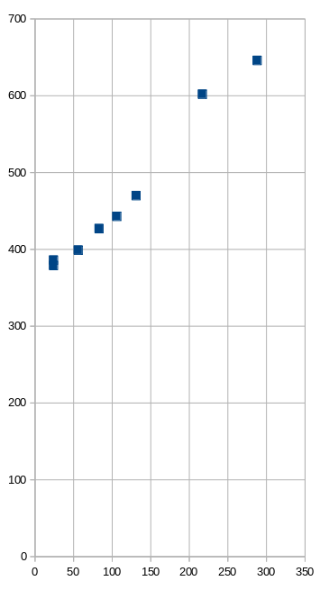
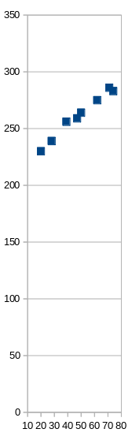

This is an investigation into the techniques used by some email (newsletter) providers to track their readers' activity. It attempts to deconstruct tracking links and pixels and highlight the data that is being collected.

Some of this work occurred during the development of email-untracker. The rest of it occurred as part of this article. It covers mailing list providers that I have personally encountered: Mailchimp, ConvertKit, Substack and other Mailgun retailers.

**TL;DR:** Mailchimp and ConvertKit were successfully analysed. Substack and Mailgun required reverse engineering and only yielded partial results (Assistance requested!). There's also some extra commentary in the appendix.

(**UPDATE 2021-06-01**: There have been some new developments since this was first posted. Please see the end of this post.)

## Mailchimp

### Tracking links

Mailchimp's tracking links are of the form `https://??.us?.list-manage.com/track/click?u=??&id=??&e=??` and contain three identifiers: `u`, `id` and `e`. 

For example, the following is a link that appears at the top of a recent email newsletter I received:

```bash
https://pointer.us9.list-manage.com/track/click?u=e9492ff27d760c578a39d0675&id=6085259441&e=626d6fa0c9
# redirects to:
https://www.pointer.io/?utm_source=Pointer&utm_campaign=d184bdae50-ISSUE_228&utm_medium=email&utm_term=0_6ba2b83261-d184bdae50-606996230
```

Near the bottom of the same email, there is a similar looking (ie. same anchor text) link:

```bash
https://pointer.us9.list-manage.com/track/click?u=e9492ff27d760c578a39d0675&id=1624638cad&e=626d6fa0c9
# redirects to:
https://www.pointer.io/?utm_source=Pointer&utm_campaign=d184bdae50-ISSUE_228&utm_medium=email&utm_term=0_6ba2b83261-d184bdae50-606996230
```

Mailchimp's links are straightforward and there are no surprises. By comparing links across different subscribers and issues of the same publication, the following can be inferred:

* `u` is the mailchimp account id of the publisher
* `id` is a link id that is unique per issue. Notice that the two links above point to the same destination URL but have different `id` values.
* `e` is the subscriber id. This number stays the same across different issues of the same publication. It differs if the email is sent to a different email address.

When you click on a mailchimp tracking link, mailchimp knows:

* Which link you clicked on (and from which email) and
* Your subscriber id

Furthermore, mailchimp validates/requires all three IDs. If any of those three values are incorrect, the tracking link doesn't work (ie. something other than a 30x HTTP code is returned).

<!-- tell how to get archive? -->

### Tracking pixel

Mailchimp's tracking pixel looks like this.

```html

```

It embeds the publisher id `u` and the subscriber id `e`.

In this case `id` appears to be a publication or issue identifier (ie. Notice `d184bdae50` appears in the `utm_campaign` and `utm_term` variables in the destination URLs above).


## ConvertKit

### Tracking links

ConvertKit's tracking links are of the form `https://click.convertkit-mail.com/<a>/<b>/<c>` with parts: `a`, `b` and `c`.

For example, here is a link that appears in a recent email I received: 

```bash
https://click.convertkit-mail.com/k0u30rg2pds6hqzw2vtl/48hvheh0nlk28rcx/aHR0cHM6Ly9sb25nLXdhdGVyLTIyMS5jay5wYWdlLzU4NDJjNTQ0OTM=
# redirects to:
https://long-water-221.ck.page/5842c54493
```

Let's try to work out what the parts are.

Part `c` immediately stands out because it looks like base64. Let's attempt to decode it.

```bash
aHR0cHM6Ly9sb25nLXdhdGVyLTIyMS5jay5wYWdlLzU4NDJjNTQ0OTM=
# base64 decodes to:
https://long-water-221.ck.page/5842c54493
```

Yep, it is. The destination URL is base64 encoded and embedded in the tracking link as part `c`.

What about `a` and `b`? There's probably an email or subscriber id in there.

Searching for the text `k0u30rg2pds6hqzw2vtl` in the email shows that it's in every tracking link. But it also appears in the headers:

```bash
Message-ID: <k0u30rg2pds6hqzw2vtl@convertkit-mail.com>
```

Ah! Part `a` is the email id.

That only leaves `b` to be deciphered. I get stuck for a while trying to guess what `b` might be.

Then, on a whim, I try changing some values and poking ConvertKit. This is the baseline:

```bash
https://click.convertkit-mail.com/k0u30rg2pds6hqzw2vtl/48hvheh0nlk28rcx/aHR0cHM6Ly9sb25nLXdhdGVyLTIyMS5jay5wYWdlLzU4NDJjNTQ0OTM=
# redirects to:
https://long-water-221.ck.page/5842c54493
```

Okay. Let's tamper with the base64 in part `c`. I'll just change one letter and see what happens (I change the last `M` to `m`).

```bash
https://click.convertkit-mail.com/k0u30rg2pds6hqzw2vtl/48hvheh0nlk28rcx/aHR0cHM6Ly9sb25nLXdhdGVyLTIyMS5jay5wYWdlLzU4NDJjNTQ0OTm=
# redirects to:
https://long-water-221.ck.page/5842c54493
```

Huh? Even though part `c` now base64-decodes to `https://long-water-221.ck.page/5842c54499`, it still redirecting to `https://long-water-221.ck.page/5842c54493` (Notice the last character is different). Something's not right.

I tamper with `c` some more.

I discover that it doesn't matter what `c` is. As long as it's at least 4 characters and valid base64, the tracking link will redirect to the correct URL.

```bash
https://click.convertkit-mail.com/k0u30rg2pds6hqzw2vtl/48hvheh0nlk28rcx/aHR0
https://click.convertkit-mail.com/k0u30rg2pds6hqzw2vtl/48hvheh0nlk28rcx/====
https://click.convertkit-mail.com/k0u30rg2pds6hqzw2vtl/48hvheh0nlk28rcx/1234
# all redirects to:
https://long-water-221.ck.page/5842c54493
```

So ... `c` embeds the destination URL in the tracking link but it's not actually used. 

Which means that something else must be used to identify the destination URL. Well, there's only `b` left so it must be `b`.

Let's recap:

* `a` is the email id. The `Message-ID` email header is supposed to be unique for each individual email.
* `b` is a link or URL id.
* `c` is the destination URL but it's not actually used by ConvertKit to compute the redirect.

When you click on a tracking link, ConvertKit knows:

* Which link was clicked (`b`), and which email the link appears in (`a`).

Since `a` is unique, presumably ConvertKit uses it to find out which subscriber did the clicking.

### Tracking pixel

ConvertKit's tracking pixel looks like this:

```html

```

It embeds part `a`. Ah, this confirms that `a` is sufficient to identify the subscriber.

### Comments

Why embed the destination URL but not use it? My guess is that it's a fallback measure. If the server side database of tracking links is down, ConvertKit can fallback to using `c` as the destination URL.


## Substack (and other Mailgun retailers)

### Tracking links

Substack has the most unfriendly and user-hostile tracking links that I've seen. It's a single undecipherable blob. Here's an example: 

```bash
http://email.substack1.exponentialview.co/c/eJxdkEuOhCAQhk_TLI1VIOqCxWz6GoZHaZOx0WDZPc7pB9vdJARSCfU_Pm-ZpiUfZl02Fuc18LGSSfTeZmKmLPaN8hCDwU43UmsUwbTglEIRt2HMRE8bZ8N5J7Hubo7eclzSZwMbFA8DUtV9b0MgqJUf0bmuRtQBGvQtBXfZ2j1ESp4MvSgfSyIxmwfzepNfN7yXw-945qn88iyT_S3GIhqsEYpaUW7apq-gsqOuNYFVspG-gXEEX7sAnXQokWR_U_W2u42t_4aKftbilDja-RXpXbRFNo7SxDZB-Tmd3U7Hs9pQ3ueeIh8DJetmCldrvuB9OAwTJcoFahgsG9Agu06qrut1e9UsWCS2CIWlKDnCUraS-ZfjD2RriM4
```

At first, I thought the blob might be a JWT because the first few characters look similar (All JWTs start with `eyJ...`) but it's not. When I put it through a base64 decoder, it still looks like gibberish.

So either it's not base64 or it's base64 with a custom alphabet or it's base64 encoding a binary data structure. 

It really looks like base64 so I experimented with custom alphabets. And didn't get anywhere.

Alright, I don't know what these blobs are but let's see if I can do some side-channel analysis.

I notice there's a correlation between the blob length and the length of the destination URL. I redirected a random selection of links and noted down the length of the blob and the URL. And graphed them.

| URL length | Blob length (Substack) |
| --- | ---|
| 24 | 379 |
| 24 | 386 |
| 56 | 399 |
| 83 | 427 |
| 106 | 443 |
| 131 | 470 |
| 217 | 602 |
| 288 | 646 |



Yep, there's a correlation. A longer URL results in a longer blob. But it's a bit fuzzy instead of being perfectly deterministic.

If it's base64 (which has 33% overhead), each extra character in the URL should increase the blob length by 1.33 characters.

Surprisingly, it's not. The gradient in the graph is roughly 1. Each extra character in the URL results in, roughly, an extra character in the blob. This is odd. They managed to do base64 with no overhead?? I put this aside for now and see what else I can find.

How large would the blob be if the URL was an empty string? This would be the value of the y-intercept ... which the graph shows to be about 360. A zero-length URL would be encoded in a blob of 360 characters. In other words, there's about 360 characters of other non-URL stuff in the blob.

<p style="text-align: center;">* * *</p>

At some point, I discover that these links aren't generated by Substack but by Mailgun. Mailgun is an outbound email provider that companies use to send out email. Mailgun is a wholesaler and its customers, such as Substack, are retailers. 

The tracking links are implemented by Mailgun. Mailgun does the tracking and posts the data to the retailer.

By happy coincidence, I find out that Buttondown, my email newsletter provider, also uses Mailgun. So I can actually generate these blobs myself and even insert my own plaintext. Fun!

My email newsletters don't have tracking links as I disable email tracking with Buttondown. However, to investigate this, I temporarily enabled email tracking. For example:

```bash
http://email.bengtan.com/c/eJyNjL0OgzAQg5-GbKBcOAIZMrRQXgPl7ygShKpN1dcvoA4dkezBlj97jc5CDWzSggvglcDdyAsoUMq277oOhbreBLQZchvimEws3Lqwu3YKFDlFHBvHq5q7WoVgSKETEoUnNut7So9XVl4y0W_6w7fEnvpXwHY9Lmaaj-OkS6iDNEQ5J0k5-mBz6wPlpkJHjTJGQcXsO6U1-vUTh7Czw-TPgcf61PQLUtRVuw
# redirects to:
https://bengtan.com/
```

I created some links, and took the same length measurements.

| URL length |	Blob length (Buttondown) |
| --- | --- |
| 20 | 230 |
| 28 | 239 |
| 39 | 256 |
| 47 | 259 |
| 50 | 264 |
| 62 | 275 |
| 71 | 286 |
| 74 | 283 |



The findings are similar. The gradient is roughly 1.

But Buttondown's blobs are shorter than Substack. The y-intercept is about 210. Buttondown's blobs have 210 characters of non-URL stuff. (Whereas Substack has 360.)

Substack's blobs have about 150 more characters than Buttondown. Why the discrepancy?

Looking at the email headers gives a clue. It turns out user-defined variables can be passed to Mailgun via a custom `X-Mailgun-Variables` header.

Substack's emails have a header like this:

```bash
X-Mailgun-Variables: {"category": "post", "email_generated_at": "1619322434978", "is_freemail": "true", "publication_id": "2252", "post_audience": "everyone", "post_id": "35529220", "pub_community_enabled": "true", "user_id": "28653662", "post_type": "newsletter", "subdomain": "exponentialview"}
```

whereas Buttondown has this:

```bash
X-Mailgun-Variables: {"buttondown_email_id": "b70ec467-2a0e-4170-8198-38a501b49ad9", "email": "b70ec467-2a0e-4170-8198-38a501b49ad9"}
```

(BTW, That's a very interesting email header. Substack is leaking out how many writers, articles, and subscribers it has.)

The difference in length between two? 163 characters. That's close enough to 150 for me to say that it accounts for the discrepancy.

Let's recap. When you click on a tracking link, I speculate you are sending to Mailgun:

* The destination URL,
* Whatever is in `X-Mailgun-Variables`,
* And some other unknown stuff which is taking up the rest of the 90 characters in the blob.

Unfortunately, I don't know what the rest of the blob contains.

### Minimal server side data

During this research, I found this link:

https://feedback.mailgun.com/forums/156243-feature-requests/suggestions/3996829-shorten-tracking-urls

which asks:

> The current URLs used for tracking link clicks are quite long. Offering a way to shorten them via Bit.ly or perhaps an custom shortened URL would be helpful.

and is replied:

> We did it once and were faced with the need to store gigantic amount of the data that we had to support forever. We'd like to avoid doing that actually.

This conversation suggests that Mailgun minimises the amount of tracking data it stores on the server side. Which sort-of agrees with my speculation that a bunch of tracking data is embedded in the (client side) blob.

### Compression

In an effort to work out the encoding, I emailed myself a link with repeating text in the URL. Presuming it's base64, I expected to see repeating characters in the blob which I could use to iteratively work out the encoding.

I was surprised again.

Here are the URLs and the effect on blog length.

| URL  | URL length | Blob length (Buttondown) |
| --- | --- | --- |
| https://bengtan.com/ | 20 | 230 |
| https://bengtan.com/?nonce=a | 28 | 239 |
| https://bengtan.com/?nonce=aaaaaaaaaaaaaaaaaaaa | 47 | 243 |
| [Like above but with 30 a's](https://bengtan.com/?nonce=aaaaaaaaaaaaaaaaaaaaaaaaaaaaaa) | 57 | 243 |
| [Like above but with 90 a's](https://bengtan.com/?nonce=aaaaaaaaaaaaaaaaaaaaaaaaaaaaaaaaaaaaaaaaaaaaaaaaaaaaaaaaaaaaaaaaaaaaaaaaaaaaaaaaaaaaaaaaaa) | 117 | 250 |

Adding `?nonce=a` increased the blob by 9 characters. As expected. Then the lengths get a bit weird.

Adding 19 `a`'s increased the blob by 4 characters. Adding another 10 didn't increase the blob at all. Finally, adding 60 more increased the blob by 7 characters.

Guess what's happening? Compression. All those extra repeating `a` characters are being compressed.

Remember when I said that, with base64, I expected each URL character to be represented in 1.33 blob characters but it was actually stored in 1 blob character? Compression would explain this too.

I suspect the blob is a (json?) data structure which is compressed and then base64-encoded.

Unfortunately, I'm haven't bit-bashed compression algorithms enough that I can recognise which algorithm is being used. And this is where I got up to.

Maybe a expert in compression can help me out? Does anyone recognise this bitstream?

```bash
eJyNjL0OgzAQg5-GbKBcOAIZMrRQXgPl7ygShKpN1dcvoA4dkezBlj97jc5CDWzSggvglcDdyAsoUMq277oOhbreBLQZchvimEws3Lqwu3YKFDlFHBvHq5q7WoVgSKETEoUnNut7So9XVl4y0W_6w7fEnvpXwHY9Lmaaj-OkS6iDNEQ5J0k5-mBz6wPlpkJHjTJGQcXsO6U1-vUTh7Czw-TPgcf61PQLUtRVuw
# base64-decodes to:
00000000: 789c 8d8c bd0e 8330 1083 919b 2817 0e00  x......0....(...
00000010: 864c ad14 1780 f97b ca04 a12a 9375 75cb  .L.....{...*.uu.
00000020: e803 8764 7b30 658f dee3 7390 835b 34a0  ...d{0e...s..[4.
00000030: 82f8 2570 3772 02ca 1432 adbb ee83 a16e  ..%p7r...2.....n
00000040: b781 2d06 5c86 f8a6 130b 372e ac2e dd82  ..-.\.....7.....
00000050: 850e 5147 06f1 eae6 aed6 a158 1228 44c4  ..QG.......X.(D.
00000060: a149 cdba ded2 a3d5 d597 8cb4 5bac 3b7c  .I..........[.;|
00000070: 49ef a57c 0763 d2e6 69a8 ce91 2ea2 0cd1  I..|.c..i.......
00000080: 10e4 9d24 e660 73eb 03e5 a642 478d 3246  ...$.`s....BG.2F
00000090: 41c5 ec3b a535 bd44 e1ec 2cf0 4cf8 1c7f  A..;.5.D..,.L...
000000a0: ad4f 40b5 2d45 5bb0 0a                   .O@.-E[..
```

Maybe at a future point, I'll try to work out what the compression algorithm is. Then I can finally decode the blob and report what those unknown 90 characters are.

### Tracking pixel

When email tracking is enabled, Mailgun inserts a tracking pixel that looks like this:

```html

```

This blob uses the same encoding as tracking links so I don't know what's in it.

### Additional tracking pixel (Substack)

Not content with Mailgun's tracking pixel, Substack inserts its own tracking pixel. That's right, Substack newsletters have **two** tracking pixels. The additional pixel looks like this:

```html

```

This one embeds a JWT. Decoding it results in this info:

```js
{
  "m": "<20210425034711.1.51be2c6f02b95e65f184807375b01669@substack1.exponentialview.co>",
  "u": 28653662,
  "r": "username@gmail.com",
  "d": "substack1.exponentialview.co",
  "p": 35529220,
  "s": 2252,
  "c": "post",
  "f": true,
  "iat": 1619322435,
  "iss": "pub-0",
  "sub": "eo",
  "alg": "HS256"
}
```

Make of that what you will.


## What data is collected?

It's evident that email tracking occurs but what data is actually being collected?

Fortunately, Mailgun's [documentation](https://documentation.mailgun.com/en/latest/api-events.html#event-structure) gives us a clue. When a tracked email is opened, or a tracking link is clicked, it posts an event to the retailer. This is an example of what's in the event.

```js
{
  "event": "opened" or "clicked",
  "id": "G5zMz2ysS6OxZ2C8xb2Tqg",
  "timestamp": 1377075564.094891,
  "log-level": "info",
  "recipient": "recipient@example.com",
  "geolocation": {
    "country": "US",
    "region": "TX",
    "city": "Austin"
  },
  "tags": [],
  "url": "http://example.com/signup",  // Only in "clicked" events
  "ip": "123.123.123.321",
  "campaigns": [],
  "user-variables": {},
  "client-info": {
    "client-type": "browser",
    "client-os": "Linux",
    "device-type": "desktop",
    "client-name": "Chromium",
    "user-agent": "Mozilla/5.0 (X11; Linux i686) AppleWebKit/537.36 (KHTML, like Gecko) Ubuntu Chromium/28.0.1500.71 Chrome/28.0.1500.71 Safari/537.36"
  },
  "message": {
    "headers": {
      "message-id": "20130821085807.30688.67706@samples.mailgun.org"
    }
  },
}
```

This is the list of data:

* An ID that identifies the email that was opened or clicked.
* Subscriber identifier
* URL (if it was a tracking link)
* Whatever the service provider injects into `tags`, `campaigns` or `user-variables`
* IP adddress
* Timestamp
* Location
* Browser (which can be used to infer what device and OS you're using)

Whilst this example is for Mailgun, we should expect that other providers like Mailchimp and ConvertKit do similar things.


## Conclusion

I hope you have found this article informative. Unfortunately I wasn't able to fully decode Mailgun's tracking links (I could do with some help from a compression expert). Maybe if I have time in the future I can revisit it.

Thank you for reading.

(I have some more comments below but they are somewhat off-topic. Feel free to skip it.)

<hr />


## Appendix

### Finding out the destination URL of a tracking link

An easy way to find out the destination URL of a tracking link is by using wget:

```bash
wget -O /dev/null --max-redirect=0 'https://pointer.us9.list-manage.com/track/click?u=e9492ff27d760c578a39d0675&id=6085259441&e=626d6fa0c9'
```

(Remember to put the tracking link in quotes.)

### Bypassing tracking links

In those cases where the destination URL is embedded into a tracking link, it's possible to avoid tracking by decoding the destination URL and navigating to it directly. This is true for ConvertKit and could be true for Mailgun retailers like Substack (when or if I eventually work out the decoding).

This is a feature that, if there was enough demand, I could add to email-untracker.

### Observations on software architecture

It's interesting how the implementation of tracking links reflects software architecture.

(Note: The following is all my own speculation.)

It's well known that Mailchimp implements sharding (Accounts are spread out over different data centers ie. `us1` to `us9`). Sharding is probably why their links require a mailchimp account id — So the server knows which shard to query for destination URLs.

ConvertKit doesn't use sharding. Their tracking links are all stored in one place. But achieving 100% uptime of a global database is hard so there is a fallback method (ie. Get the destination URL from `c`) if the database is down.

Mailgun takes a different aproach. It doesn't store tracking links in a database at all. Instead, the data is embedded in the tracking link's blob on the client side and sent to the server when clicked.

This is a much more scalable technique because it doesn't require access to a single point of failure (ie. the database). The downside is that the blobs are extremely long and user-unfriendly.

----

## UPDATE 2021-06-01

With the assistance of a very helpful [reddit](https://www.reddit.com/r/programming/comments/nppkeg/whats_in_email_tracking_links_and_pixels/) user, the Mailgun/Substack blob has been deciphered. It's zlib compressed and then base64url encoded. I will follow-up on this with a future blog post when I have time. If you'd like to be notified, please subscribe.
